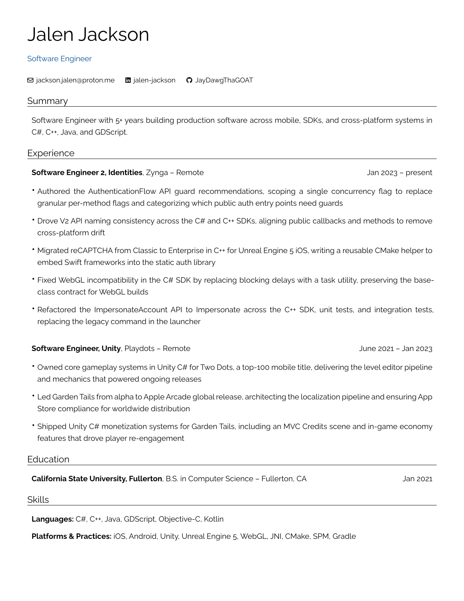

# Jalen Jackson

Software Engineer.

- Email: [jackson.jalen@proton.me](mailto:jackson.jalen@proton.me)
- LinkedIn: [jalen-jackson](https://www.linkedin.com/in/jalen-jackson)
- GitHub: [JayDawgThaGOAT](https://github.com/JayDawgThaGOAT)

My resume, written as YAML and rendered to PDF, HTML, and Markdown using [RenderCV](https://github.com/rendercv/rendercv) — a Typst-based resume builder for engineers and academics.

**[PDF](rendercv_output/Jalen_Jackson_CV.pdf)** · **[HTML](rendercv_output/Jalen_Jackson_CV.html)** · **[Markdown](rendercv_output/Jalen_Jackson_CV.md)**

[](rendercv_output/Jalen_Jackson_CV.pdf)

**Why this approach:**

- Resume content lives in a single YAML file — version-controlled, diffable, no Word blobs
- Typst produces LaTeX-quality PDFs that are ATS-safe (real selectable text)
- Changing the visual design is a one-line theme swap, not a reformatting session
- GitHub Actions auto-renders on every relevant push — the PDF in this repo stays current

---

## Repository structure

```
.
├── Jalen_Jackson_CV.yaml          # Content + design
├── rendercv_output/               # Generated PDF, HTML, Markdown, PNG (committed)
├── .github/workflows/render.yml   # Auto-render on push to main
├── AGENTS.md                      # Instructions for AI agents
└── README.md
```

Company-tailored copies (`Jalen_Jackson_CV_<Company>.yaml`) are local apply artifacts and are gitignored.

---

## Prerequisites

- Python 3.10 or newer
- `uv` (recommended) or `pip`

---

## Installation

### Recommended: using `uv`

```bash
curl -LsSf https://astral.sh/uv/install.sh | sh
uv tool install "rendercv[full]==2.8"
```

### Alternative: using `pip`

```bash
pip install "rendercv[full]==2.8"
```

### Alternative: repo virtualenv

```bash
python3 -m venv .venv
.venv/bin/pip install -U pip
.venv/bin/pip install -r requirements.txt
```

Cursor/VS Code tasks use `.venv/bin/rendercv`. Verify:

```bash
rendercv --version   # or .venv/bin/rendercv --version — expect RenderCV v2.8
```

---

## Generating the resume

```bash
rendercv render Jalen_Jackson_CV.yaml
```

Output goes to `rendercv_output/`.

### Watch mode

```bash
rendercv render --watch Jalen_Jackson_CV.yaml
```

In Cursor or VS Code: **Terminal → Run Task…** → `RenderCV: Render CV` or `RenderCV: Watch CV`.

### Render with a different theme

```bash
rendercv render Jalen_Jackson_CV.yaml --design.theme engineeringresumes
rendercv render Jalen_Jackson_CV.yaml --design.theme moderncv
rendercv render Jalen_Jackson_CV.yaml --design.theme sb2nov
```

---

## Customizing the resume

Open `Jalen_Jackson_CV.yaml`. The file has these sections:

| Section | Purpose |
| --- | --- |
| `cv` | Content: name, contact, experience, education, skills |
| `design` | Theme, font, colors, margins, page size |
| `locale` | Language / date formatting |
| `settings` | Output paths and render options |

The YAML file includes a `$schema` line for autocompletion and validation. Install the [YAML extension](https://marketplace.visualstudio.com/items?itemName=redhat.vscode-yaml). See [RenderCV’s VS Code guide](https://docs.rendercv.com/user_guide/how_to/set_up_vs_code_for_rendercv/).

---

## AI agent skill

RenderCV provides a skill for Claude Code, Cursor, Copilot, and other agents. This repo also vendors it at `.agents/skills/rendercv/`.

```bash
npx skills add rendercv/rendercv-skill -a cursor
```

See [RenderCV’s AI skill docs](https://docs.rendercv.com/user_guide/how_to/use_the_ai_agent_skill/).

---

## GitHub Actions (auto-render on push)

[`.github/workflows/render.yml`](.github/workflows/render.yml) renders the resume when `Jalen_Jackson_CV.yaml` changes on `main` and commits `rendercv_output/`.

**To enable commits from Actions:**

1. Go to **Settings → Actions → General**
2. Under **Workflow permissions**, select **Read and write permissions**
3. Save

---

## References

- [RenderCV GitHub](https://github.com/rendercv/rendercv)
- [RenderCV Documentation](https://docs.rendercv.com)
- [RenderCV YAML Schema](https://docs.rendercv.com/user_guide/yaml_input_structure/)
- [RenderCV Themes](https://docs.rendercv.com/user_guide/yaml_input_structure/design/)
- [RenderCV AI Skill](https://docs.rendercv.com/user_guide/how_to/use_the_ai_agent_skill/)
- [ATS Compatibility](https://docs.rendercv.com/ats_compatibility/)

Agent-specific editing rules live in [AGENTS.md](AGENTS.md).
